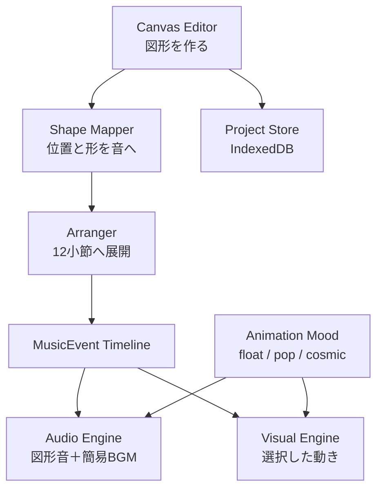

# OtoCanvas

8種類の図形スタンプやペンで描く3つのシーンが、30秒の音楽と幾何学MVへ育つWebアプリです。音符やタイムラインを覚えなくても、図形の位置・大きさ・色・角度・重なり・つながりから音楽を作れます。

OtoCanvasは生成AIで完成品を自動生成するサービスではありません。子どもが作った図形や線を「音楽の種」として、決定的なルールベース編曲で12小節・48拍の作品へ展開します。同じ絵・シード・アニメーションの雰囲気からは、いつでも同じ曲と映像が再現されます。

## 体験の流れ

1. 「はじめる」を押す。
2. 音の世界を選ぶ。
3. 丸、三角、線、四角、ひし形、星、六角形、輪の8スタンプを置くか、ペンで自由に描く。
4. 「はじまり・なか・おわり」の3シーンを描き、図形を重ねたりペンで近くの図形をつないだりする。
5. 図形を動かし、大きさ・8色のパレット・角度を変える。色ごとに音の高さ・長さ・強さも変わる。
6. リミックスで、絵を変えずに別の編曲を試す。
7. 再生前に、MVとBGMの雰囲気を「ゆらゆら」「はじける」「ぐるぐる」から選ぶ。
8. 再生中の図形を触り、ライブで音と映像を追加する。
9. 作品棚へ端末内保存し、WAV・音付きWebM MV・3シーンのPNGジャケットを書き出す。

| 図形・ツール | 楽器らしい合成音 | 映像の反応 |
|---|---|---|
| 丸 | マリンバ | 膨らむ・跳ねる |
| 三角 | 太鼓 | 脈打つ・分裂する |
| 線 | ベース | 波打つ |
| 四角 | ピアノ | 伸縮する・格子を作る |
| ひし形 | ハープ | 回転する・往復する |
| 星 | グロッケン（鉄琴） | 光る・小さく弾ける |
| 六角形 | カリンバ | 連結する・広がる |
| 輪 | チャイム | 波紋を広げる |
| ペン | フルート | 描いた線をなぞる |

これらは録音された本物の楽器音ではなく、Web Audio APIだけで作る「楽器らしい合成音」です。外部音源や音声ファイルの読み込みを必要とせず、図形を置いた直後のプレビュー、30秒の曲とMVの再生、WAV書き出しのすべてで同じ楽器対応を使います。

## 音世界とアニメーションの雰囲気

OtoCanvasには、役割の異なる二つの選択があります。

- 音世界「ふわり」「ぽんぽん」「きらり」：曲の基準音、配色、編曲の変奏を決める。
- アニメーションの雰囲気「ゆらゆら」「はじける」「ぐるぐる」：再生中の移動・回転・拡縮・軌道・残像と、後ろで小さく流れる簡易BGMを決める。

この二つは別軸です。例えば、音世界を「ふわり」にしたまま、ゆっくり漂う「ゆらゆら」、弾けて飛び回る「はじける」、大きな軌道を描く「ぐるぐる」のどれでも選べます。

| 雰囲気 | MVの動き | 簡易BGM |
|---|---|---|
| ゆらゆら（`float`） | 滑らかな漂い、呼吸するような拡縮、緩い往復と軌道 | 長めのピアノ音と控えめなチャイム・フルート |
| はじける（`pop`） | 跳ね返り、素早い回転、外側へ弾ける移動と短い残像 | 軽いドラム、弾むベース、裏拍のピアノ |
| ぐるぐる（`cosmic`） | 円・らせん軌道、奥行きのある拡縮、長めの軌跡 | 持続するフルートと星のようなチャイム・鉄琴 |

簡易BGMもWeb Audio APIによるルールベース合成です。外部の楽曲や音源ファイルは使いません。BGMは低い音量に固定し、子どもが置いた図形・ペンの楽器音を常に前景にします。WAV書き出しにも、その時点で選んでいる雰囲気のBGMが含まれます。

## 特徴

- 文字を十分に読めなくても分かる、大きな操作対象と短い案内
- 「ふわり」「ぽんぽん」「きらり」の3つの音世界
- 再生直前に選べる「ゆらゆら」「はじける」「ぐるぐる」の3つのアニメーション雰囲気
- 8種類の図形スタンプと、指やマウスで自由に描けるペン
- 丸はマリンバ、三角は太鼓というように、8図形とペンへ一つずつ異なる楽器らしい合成音を割り当て
- 図形を選んで使える8色のカラーパレット
- 大きさの変更に加え、回転ボタンで角度を変えられる編集操作
- 横位置を16ステップのリズム、縦位置をペンタトニック音階へ変換
- 図形の重なりで和音、近さで掛け合い、輪の内側で反響、ペンの近くに並べた図形で「音の道」を生成
- 色ごとに高さ・余韻・音量感を変える8種類の音色キャラクター
- 10秒ずつの「はじまり・なか・おわり」を描く3シーンMV
- 同じ絵から決定的な別アレンジを作るリミックス
- 再生中の図形を直接鳴らせるライブタッチ
- サムネイル付き作品棚、名前変更、複製、個別削除
- 音付きWebM MV、3シーンPNGジャケットの保存
- Intro / A / B / Break / Climax / Outroからなる固定長の編曲
- 音楽イベントと同じデータから描画する、ずれにくい幾何学MV
- 移動・回転・拡縮・軌道・残像を組み合わせ、Climaxで画面全体へ広がる派手なアニメーション
- セクションが変わっても座標を瞬時に置き換えず、前の位置から必ず連続してスライドする移動
- 雰囲気ごとに異なる、低音量のルールベース簡易BGM
- MVの上に埋もれない、文字付きの「編集へ戻る」ボタン
- 最大同時発音数8、音域制限、音量制御による破綻しにくい出力
- 端末内保存、オフライン利用、WAV書き出し
- GitHub Pagesだけで公開できる静的構成


## 技術スタック

| 領域 | 技術 | 役割 |
|---|---|---|
| UI | React 18 + TypeScript | 画面状態と操作フロー |
| ビルド | Vite | 開発サーバーと静的サイト生成 |
| 描画 | Canvas 2D | エディターとリアルタイムMV |
| 音声 | Web Audio API | 外部音源なしで9種類の楽器音と3種類の簡易BGMを合成し、プレビュー・30秒再生・WAVへ共通利用 |
| 保存 | IndexedDB | 作品をブラウザ内へ永続化 |
| オフライン | Web App Manifest + Service Worker | PWAとして再訪時にも利用 |
| テスト | Vitest + Playwright | 音楽ロジックと主要操作の回帰防止 |

## アーキテクチャ

音と映像が別々に判断しないことが、この構成の中心です。キャンバス上の図形を一度だけ`MusicEvent`へ変換し、Audio EngineとVisual Engineが同じタイムラインを読みます。



主なディレクトリは次の通りです。

```text
src/
  app/       画面遷移とアプリ全体の状態
  canvas/    図形の編集・当たり判定・描画
  music/     図形変換、編曲、簡易BGM、音階、音声再生
  visuals/   雰囲気別MVの状態計算と描画
  storage/   端末内の作品保存
  export/    WAV生成
  pwa/       Service Worker登録
  types/     共有データモデル
tests/       Vitestによる音楽ロジックのテスト
e2e/         Playwrightによる主要操作テスト
```

## 編曲設計

曲は96 BPM、4/4拍子、12小節・48拍（30秒）に固定されています。

| 小節 | 拍 | セクション | 役割 |
|---|---:|---|---|
| 1–2 | 0–8 | Intro | 図形を少しずつ紹介 |
| 3–4 | 8–16 | A | 基本モチーフを定着 |
| 5–6 | 16–24 | B | 回転・移調で変化 |
| 7–8 | 24–32 | Break | 音数を減らす |
| 9–10 | 32–40 | Climax | 音と動きを広げる |
| 11–12 | 40–48 | Outro | 一つずつ静かに消す |

図形の横位置は1小節16ステップへ量子化します。縦位置は世界ごとのメジャー・ペンタトニックへ変換し、不協和になりにくくします。編曲の揺らぎにはシード付き疑似乱数を使うため、保存後に開き直しても結果が変わりません。

## デザイン方針

- 主対象は4〜6歳。保護者と一緒に使う場合も想定する。
- 読解を前提にせず、図形、色、アニメーション、短い音で意味を伝える。
- タップ対象を大きくし、ドラッグ精度を要求しすぎない。
- 失敗ではなく「取り消す」「やり直す」で安心して試せるようにする。
- 色だけに意味を持たせず、形とラベルも併用する。
- 強い点滅や過剰な画面振動を避ける。
- `prefers-reduced-motion`など端末側の設定を尊重する。
- 低負荷モードでは残像数と複製数を減らし、音との同期を優先する。

## 子どもの安全・プライバシー

OtoCanvasはバックエンド、アカウント、チャット、広告、課金、外部AI APIを持ちません。作品データはIndexedDBへ端末内保存し、アプリから外部サーバーへ送信しません。

- 氏名、メールアドレス、生年月日、位置情報を収集しない
- カメラ、マイク、連絡先へアクセスしない
- 行動分析・広告トラッキングを組み込まない
- 自由記述による他者との通信機能を持たない
- WAV保存はユーザーの明示操作でのみ開始する
- 作品削除は対象を示し、誤操作しにくい確認を行う

GitHub Pages上のファイル取得には通常のWebアクセスが発生しますが、OtoCanvas自身が作品内容をアップロードすることはありません。公開前には、導入するホスティングやアクセス解析の設定も含めて再確認してください。

## 対応ブラウザ

- 第一対象：最新版Google Chrome
- 第二対象：最新版Microsoft Edge、Safari
- スマートフォンでも表示可能ですが、制作体験は横長のPCまたはタブレットを推奨

Web Audio APIやService Workerの挙動はブラウザにより異なるため、公開前に実機で音量、復帰、オフライン再訪、タッチ操作を確認してください。

## ライセンス

OtoCanvas本体は[MIT License](./LICENSE)で提供します。利用中のOSSと素材の扱いは[THIRD_PARTY_NOTICES.md](./THIRD_PARTY_NOTICES.md)を参照してください。
