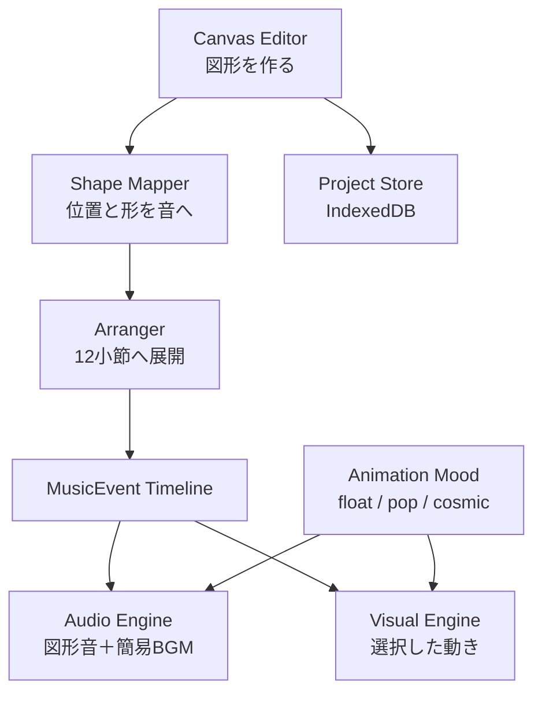

# OtoCanvas

8種類の図形スタンプやペンで描く1〜10のシーンが、30秒の音楽と幾何学MVへ育つWebアプリです。音符やタイムラインを覚えなくても、図形の位置・大きさ・色・角度・重なり・つながりから音楽を作れます。

OtoCanvasは生成AIで完成品を自動生成するサービスではありません。子どもが作った図形や線を「音楽の種」として、決定的なルールベース編曲で12小節・48拍の作品へ展開します。同じ絵・シード・アニメーションの雰囲気からは、いつでも同じ曲と映像が再現されます。

## 体験の流れ

1. 「はじめる」を押す。
2. 音の世界を選ぶ。
3. 丸、三角、線、四角、ひし形、星、六角形、輪の8スタンプを置くか、ペンで自由に描く。配置上限はペンを含めて1シーン50個（最大10シーン合計500個）。
4. 「−」「＋」で1〜10場面へ増減して描き、図形を重ねたりペンで近くの図形をつないだりする。
5. 図形を動かし、大きさ・8色のパレット・角度を変える。色ごとに音の高さ・長さ・強さも変わる。
6. リミックスで、絵を変えずに別の編曲を試す。
7. 編集画面の右下にある「▶ さいせい」を押し、選択中の場面の動きを15種類から選ぶか「この うごきで さいせい」で設定済みの振り付けを再生する。再生ボタンは図形ツールと分け、キャンバス上に重ねて表示する。
8. 再生中の図形を触り、ライブで音と映像を追加する。
9. 作品棚へ端末内保存し、WAV・音付きWebM MV・全場面のPNGジャケットを書き出す。

### 小さい画面でのツール操作・最大化

- 2026-09-26：`src/styles/global.css`の`.gallery-screen`を縦スクロールの通常フローへ変更し、`.gallery-grid`とカードの最小幅を画面幅内に制限。スマホ縦画面は1列、横画面は幅に合わせた列数で表示します。`.app-shell`を動的ビューポート高へ追従させ、ブラウザのバー開閉・縦横切替に対応。`e2e/mobile-gallery.spec.ts`で長い作品名を含む8作品の末尾までの縦スクロール・作品を開く操作・回転後のキャンバス寸法を確認します。

- 編集キャンバスは通常表示・最大化のどちらでもアプリの表示領域全体に広がります。上部操作・シーン切替・下部ボタンはその上に重なり、ボタンのない透明な部分では端まで図形配置・ペン描画ができます。ブラウザのタブやアドレスバーはアプリの表示領域に含みません。
- 編集画面左下の丸ボタンで図形ツールを開閉できます。小さい画面（幅760px以下または高さ500px以下）では最初は収納され、選択中の図形のアイコンを丸ボタンに表示します。
- ツールは約0.65秒かけて下からスライドし、閉じると画面外まで移動します。「しまう」のタップ、見出し部分の下向きスワイプ、ツール内でのEscでも閉じられます。収納中は色・大きさのパネルも隠してキャンバスを広く使えます。閉じても選択ツールや図形は保持されます。
- 編集画面・演奏画面の「ひろげる」で最大化、「もどす」で解除します。対応ブラウザでは全画面にし、編集時の上部バーも隠します。全画面APIの非対応・拒否時はブラウザ内の編集領域拡大に切り替わり、ブラウザのアドレスバー自体は隠せません。
- 端末の「動きを減らす」設定ではスライドをほぼ瞬時に切り替えます。

- 2026-09-26：`src/app/App.tsx`と`src/styles/global.css`に収納式図形ツール・丸ボタン・スワイプ操作・狭い画面の配置を追加。`src/app/useFullscreen.ts`に全画面切替と非対応時の代替表示を追加。`e2e/compact-editor.spec.ts`でPC・スマホ縦横画面、収納中の操作、最大化・解除を検証。
- 2026-09-26：`src/styles/global.css`の`.canvas-stage`を全面配置へ変更し、`.top-bar`・`.creation-playback`を重ねて表示。外周の余白と角丸枠、上下の専用領域を廃止し、透明な部分の入力はキャンバスへ通すように変更。`e2e/compact-editor.spec.ts`でキャンバス寸法と画面上下端の配置を検証。

以下は「ぽんぽん」の楽器対応です。

| 図形・ツール | 楽器らしい合成音 | 映像の反応 |
|---|---|---|
| 丸 | マリンバ | 膨らむ・跳ねる |
| 三角 | 太鼓 | 脈打つ・分裂する |
| 線 | ベース | 波打つ |
| 四角 | ピアノ | 伸縮する・格子を作る |
| ひし形 | ハープ | 回転する・往復する |
| 星 | グロッケン（鉄琴） | 光る・小さく弾ける |
| 六角形 | カリンバ | 連結する・広がる |
| 輪 | チャイム | 波紋を広げる |
| ペン | フルート | 描いた線をなぞる |

これらは録音された本物の楽器音ではなく、Web Audio APIだけで作る「楽器らしい合成音」です。外部音源や音声ファイルの読み込みを必要とせず、図形を置いた直後のプレビュー、30秒の曲とMVの再生、WAV書き出しのすべてで同じ楽器対応を使います。

## 音世界とアニメーションの雰囲気

### おとな向けの機能設定

- 2026-09-26：`ControlIcon.tsx` に24px・太線の共通SVGアイコンを追加。`App.tsx` / `ProgramEditor.tsx` / `CelebrationCamera.tsx` の並べ替え・閉じる・拡縮・回転・取り消し・リミックス・削除・設定・全画面・一時停止を文字記号から置換。並べ替えは塗りつぶし三角形、閉じるは太い×、全削除はごみ箱で示します。`global.css` で場面増減・図形調整の操作領域を最低44pxへ拡大し、無効ボタンは薄すぎる透明表示をやめ、グレーと破線で区別します。

- 2026-09-26：`global.css` の `.parent-panel` に専用の明るい配色を設定し、「きらり」でも通常・無効ボタンと文字が同系色にならないよう修正。`App.tsx` の `BackIcon` で、作品棚・音世界選択・編集・演奏・完成画面から戻る操作を塗りつぶしの左向き三角形に統一しました。

初回には保護者向けの撮影説明を表示します。「同意してカメラを許可」で音声なし・内カメラ優先の権限を要求し、確認用の映像ストリームはすぐ停止します。「使わない」や権限拒否では子どもの画面に撮影機能を表示しません。「おとなの方へ」で再度有効化・無効化できます。選択はlocalStorageの `otocanvas.camera.v1`（`on` / `off`）へ保存します。ブラウザの永続的な許可はアプリから強制できず、設定のオフはブラウザ権限の取り消しとは別です。対応ブラウザでは権限取消しも監視し非表示に戻します。

許可済みの場合だけ、完成画面に「できた！ しゃしんを とる」が出ます。手動でピース写真を撮り、鏡像のプレビュー・撮り直し・JPEGダウンロードができます。ポーズの自動認識はしません。写真はアプリのメモリにだけ保持し、閉じると破棄します。撮影後・閉じる・背景移行・ページ離脱でカメラを停止します。写真・映像のアップロードやマイク取得は行いません。カメラのないPCではエラー表示、HTTPS外ではブラウザの制約があります。内カメラ指定は優先指定なので、端末によって利用可能な別カメラになる場合があります。

### 再編集できる作品ファイルとデータ整理

「おとなの方へ」の「作品を書き出す」で `.otocanvas` ファイルを保存します。編集中は現在の作品、ロゴ画面では最後の保存作品が対象です。「作品を読み込む」から開くと別の作品IDで作品棚へ追加して編集に戻ります。編集中の作品は先に保存し、同じファイルを再読込しても既存作品を上書きしません。親向け設定・写真は含めません。音符は図形とシードから再生成するため、将来の編曲アルゴリズム変更によって再生結果が変わる可能性があります。

形式はUTF-8 JSONです。先頭の `format` は `otocanvas`、`fileVersion` は `1`、`project` は既存のversion 1作品形式です。`project.events` は空配列で保存し、図形（非表示の場面を含む）・色・位置・音世界・シード・場面数・場面ごとの動きを保持します。10MB以下・全体500図形以下・各場面50図形以下・ペン1図形の点列20,000点以下を検証し、破損・未対応版・不正座標・重複IDは取り込みません。

「キャッシュ・作業メモリ」の「整理する」は確認後に作品を永続保存し、古い`oto-canvas-shell-`のCache Storageを整理して再読み込みします。**現在の版のオフライン起動用データ、作品、親向け設定は残します**。更新待機中は新版のキャッシュも保護します。保存やキャッシュ準備ができないときは再読み込みを中止します。ブラウザ全体のキャッシュや端末全体のRAMを消す機能ではありません。「保存データ」の「すべて消す」は確認後に作品棚と編集中の作品を消し、親向け設定は残します。ダウンロード済みファイルは削除しません。

- 2026-09-26：`cameraSettings.ts` と `App.tsx` に保護者説明・撮影同意・非表示・再設定を追加。`CelebrationCamera.tsx` に手動撮影・JPEG・ストリーム解放を実装。`projectFile.ts` の `serializeProject` / `parseProjectFile` に専用ファイル形式と検証を追加。`App.tsx` の `importProjectFile` / `exportProjectFile` / `clearCacheAndRestart` / `deleteSavedData` で読み込み・書き出し・整理・削除後の自動保存抑止を対応。`projectStore.ts` の `saveProject` に `requirePersistent` を追加し、メモリのみの保存では再起動させない。`global.css` に撮影プレビューを追加。`tests/projectFile.test.ts` / `e2e/camera-files.spec.ts` で形式検証・許可と拒否・停止・JPEG・ファイル往復・キャッシュ整理を検証。カメラ検証は模擬映像で、実機の内カメラ・権限UIは未検証。

### 子どもに表示する編集機能

最初のロゴ画面の「おとなの方へ」から「子どもに表示する機能」を選べます。年齢や能力の判定は行わず、保護者が興味・慣れ具合に合わせて変更します。

- **図形と色であそぶ**：図形の配置・移動・色変更・削除、ペン、再生を使えます。場面タブ・場面増減・動き選択・リミックス・大きさ・回転を隠します。回転・拡縮のキャンバスハンドル、キー、ホイール操作も無効です。新規作品は1場面で、再生時の動き選択を省略します。
- **動きも編集する**：従来の編集道具に加え、1〜10場面・15種類の集団の動きを編集できます。未設定時は従来どおりこのモードです。
- **プログラミングであそぶ**：場面の「プログラム」から動きの命令を1〜6枚並べ、全体を1〜3回くり返します。

切り替えは作品を削除・変換しません。「図形と色」では既存作品の最初の場面を編集し、演奏・書き出しでは保存済みの全場面と動きを保持します。戻すと他の場面も再び編集できます。保存したプログラムも全モードで再生されます。「動きも編集する」で別の動きを選ぶと、その場面のプログラムを解除して単一動作に戻します。

設定は作品のIndexedDBとは別に、同じオリジンのlocalStorageキー `otocanvas.parent-settings.v1` の `creationMode`（`basic` / `motion` / `program`）へ自動保存します。同じ端末でも別ブラウザ・別ドメインとは共有しません。ブラウザのサイトデータ削除でリセットされます。アプリの「保存データをすべて消す」は作品だけを消し、この設定は残します。保存に失敗した場合は親向け画面で通知し、その画面を開いている間は選択を適用します。既存の音量・軽い動きの設定は今回の永続化対象には含みません。

- 2026-09-26：`storage/parentSettings.ts` の `loadCreationMode` / `saveCreationMode` を追加。`App.tsx` の `changeCreationMode` で保存・表示切替を行い、新規作成と直接再生を対応。`CanvasEditor.tsx` の `allowTransforms` と `shapeRenderer.ts` の `drawSelection` / `renderShapes` で簡易モードの入力・ハンドルを制限。`global.css` にスマホでも読める親向け選択欄を追加。`e2e/parent-settings.spec.ts` でスマホ縦横・再読み込み・既存作品保持・保存失敗時を検証。パスワードや保護者認証によるロック機能は含みません。

### 場面ごとの集団の動き

### プログラミング入門：順番とくり返し

保護者が「プログラミングであそぶ」を選ぶと、各場面の動き編集が命令カードに変わります。カードを押して15種類から選び、「←」「→」で並べ替え、「＋」で追加、「×」で削除します。1枚を最低限として最大6枚まで。カード列全体を1〜3回くり返し、反復の入れ子はありません。「うごき１つに もどす」でその場面のプログラムを解除できます。未設定の場面は従来の動きを使います。

30秒・場面の均等配分を保ち、命令ごとの時間は `30 ÷ 場面数 ÷ 命令数 ÷ 反復数` 秒です。命令の順番は補完・変更しません。場面や命令を増やすほど1命令は短くなり、編集画面に秒数を示します。再生画面では現在の命令を枠で強調し、何回目かを表示します。振り付けの時計は命令ごとに戻し、音楽への反応・演奏中のタップは継続します。プログラムは振り付けを制御し、編曲・場面のBGMは従来どおりです。

自動保存、作品棚、複製、`.otocanvas` の読み書き、MV録画に対応します。プログラムは `scenePrograms` に場面順で保存し、未設定は `null`、設定済みは `{ "moves": ["wave", "pop"], "repeat": 2 }` の形式です。フィールドがない旧作品は従来どおり再生します。親向け設定の変更・末尾場面の非表示だけではプログラムを消しません。実行中カードのUI自体はMVに含めず、キャンバスの振り付けを録画します。

- 2026-09-26：`ProgramEditor.tsx` に命令の追加・選択・順序変更・削除・反復を実装。`motionProgram.ts` の `programStepAtBeat` / `isScenePrograms` / `copyScenePrograms` に実行・検証・複製を集約。`App.tsx` と `parentSettings.ts` に `program` モード、再生中表示、保存・復元の接続を追加。`PerformanceCanvas.tsx` / `visualEngine.ts` は `motionSeconds` で命令内の振り付け時計を扱います。`types/project.ts` / `arranger.ts` / `projectStore.ts` / `projectFile.ts` は任意の `scenePrograms` を保持し検証。`global.css` にスマホ対応のカード編集と実行表示を追加。`tests/motionProgram.test.ts` / `e2e/program-editor.spec.ts` で反復境界・保存互換・スマホ縦横・実再生を検証。タッチ条件、待つ命令、集団分け、場面だけの試し再生は今回含みません。

### 動きの選択と見本

- 2026-09-26：`App.tsx` の動きカードにおすすめの音世界を表示し、カードの色も統一。ゆらゆら・なみなみ・ふくらむ・ぶらんこ・あつまる・ふわっとのぼる・ひらひらおちるは「ふわり」、はじける・こうしん・ジグザグ・ひろがるは「ぽんぽん」、ぐるぐる・うずまき・はちのじ・かいてんもくばは「きらり」。おすすめは案内のみで、選択済みの音世界や演奏内容は変更せず、どの組み合わせでも使えます。

- 2026-09-26：動き選択カードの見本を `MotionPreview.tsx` の15種類のSVG図解へ変更。波線・折れ線・振り子・らせん・内向き／外向き矢印などで静止時にも区別し、図形が軌道に沿って動きます。`App.tsx` は各動き固有の説明文を表示し、`global.css` の3系統を流用した旧アニメーションを撤去。端末の「動きを減らす」では静止図解になります。演奏本体・作品データ・BGMは変更していません。`e2e/motion-previews.spec.ts` で15図解・スマホ表示・動きの停止と再開・選択操作を確認します。

編集画面上部の「−」「＋」で場面数を1〜10へ変更できます。曲は常に30秒で、各場面は `30 ÷ 場面数` 秒です。場面タブを選び「うごき」を押すと、その場面に登場する図形の集団の動きを選べます。空の場面は近くの使用中の場面の絵を引き継ぎ、動きだけを変えることもできます。減らした末尾の場面はデータを保持し、「＋」で戻せます。使用中の場面のみが演奏・WAV・MV・ジャケットの対象です。

動きは、ゆらゆら・はじける・ぐるぐる・なみなみ・こうしん・うずまき・ふくらむ・ぶらんこ・ジグザグ・あつまる・ひろがる・ふわっとのぼる・ひらひらおちる・はちのじ・かいてんもくばの15種類。開始タイミングと長さは自動です。伴奏は従来の3系統から動きに合わせて選びます（15種類の独立した伴奏ではありません）。

- 2026-09-26：`App.tsx`に場面増減・場面別の動き選択と復元を追加。`types/project.ts`・`projectStore.ts`に任意の`sceneCount`／`sceneMoods`と0〜9の場面番号を追加し、省略された旧作品は3場面・ゆらゆらとして読み込みます。`creativeRules.ts`の`sceneForBeat`・`shapesForScene`、`arranger.ts`の`buildArrangement`、`backingTrack.ts`の`buildSceneBackingTrack`で小節途中の境界も音と映像をそろえます。`animationMood.ts`・`visualEngine.ts`の`groupChoreography`で15動作を定義し、`PerformanceCanvas.tsx`・`global.css`で表示と選択見本を対応。`artworkExporter.ts`の`downloadJacketPng`と`ProjectThumbnail.tsx`は使用中の場面を反映します。`tests/scenePlan.test.ts`・`e2e/scene-plan.spec.ts`で保存互換・増減・境界・スマホ縦横・実再生を検証。個別図形のプログラムや自由なタイムライン編集は含みません。

OtoCanvasには、役割の異なる二つの選択があります。

- 音世界「ふわり＝こえ・おもちゃ・まんが」「ぽんぽん＝楽器」「きらり＝電子音」：音源、曲の基準音、配色、編曲の変奏を決める。
- 場面ごとの15種類の動き：再生中の移動・回転・拡縮・軌道を決める。簡易BGMは「ゆらゆら」「はじける」「ぐるぐる」の3系統に対応づける。

この二つは別軸です。例えば、音世界を「ふわり」にしたまま、ゆっくり漂う「ゆらゆら」、弾けて飛び回る「はじける」、大きな軌道を描く「ぐるぐる」のどれでも選べます。

| 図形 | ふわり：こえ・おもちゃ・まんが | きらり：電子音 |
|---|---|---|
| 丸 | あーの声 | ピコピコ |
| 三角 | 口でポッ | 電子ドラム |
| 線 | ぽよん | シンセベース |
| 四角 | あひるのおもちゃ | 電子キー |
| ひし形 | びよーん（口琴） | レーザー |
| 星 | キュッ | 宇宙ベル |
| 六角形 | ボールぽん | ロボット |
| 輪 | ヒューの笛 | レーダー |
| ペン | ハミング | 宇宙パッド |

ふわりはCC0の声・おもちゃ・まんが効果音9点を同梱し、以前の環境音風の合成を置き換えました。原音の短い区間を無音除去・モノラル化・22,050Hz化・音量調整・フェード処理し、再生速度で音高を変えます。声や効果音には元の抑揚・ノイズがあるため、楽器のような完全に一定の音高ではありません。ド〜高いドは同音へ折り返さず1オクターブの移調が可能です。自動編曲の極端な低音・高音だけ声質を保つ音域へ移します。きらりの電子合成とぽんぽんの楽器は維持します。試聴・画面BGM・演奏・タップ・MV・WAVは共通PCM処理を使います。

- 2026-09-26：`src/music/worldSounds.ts`に音源ラベル・環境音風／電子音の共通合成波形を追加。`audioEngine.ts`の`triggerWorldSound`と`wavExporter.ts`の`renderEvent`で使用。`arranger.ts`・`backingTrack.ts`で`MusicEvent.soundWorld`を付与し、`scales.ts`・`instrumentPhrases.ts`で環境音と電子音の打楽器枠にも旋律を追加。`App.tsx`・`types/project.ts`のコース説明と図形の音名を更新。`projectStore.ts`で任意の音世界フィールドを検証。保存形式はversion 1のままで、旧イベントのフィールド省略を許容します。旧作品もアプリ内で読み込むと音世界に合わせて再編曲されるため、ふわり・きらりの音色は変わります。`tests/worldSounds.test.ts`・`e2e/sound-worlds.spec.ts`で波形・音程・WAV・保存互換・実発音経路を検証します。

| 雰囲気 | MVの動き | 簡易BGM |
|---|---|---|
| ゆらゆら（`float`） | 滑らかな漂い、呼吸するような拡縮、緩い往復と軌道 | 長めのピアノ音と控えめなチャイム・フルート |
| はじける（`pop`） | 跳ね返り、素早い回転、外側へ弾ける移動と短い残像 | 軽いドラム、弾むベース、裏拍のピアノ |
| ぐるぐる（`cosmic`） | 円・らせん軌道、奥行きのある拡縮、長めの軌跡 | 持続するフルートと星のようなチャイム・鉄琴 |

簡易BGMもWeb Audio APIによるルールベース合成です。外部の楽曲や音源ファイルは使いません。BGMは低い音量に固定し、子どもが置いた図形・ペンの楽器音を常に前景にします。WAV書き出しにも、その時点で選んでいる雰囲気のBGMが含まれます。

試聴・再生・MV録音の初期音量は70%で、おとな向け設定から0〜100%に調整できます（以前の調整上限は70%）。全体の音量を上げても図形音とBGMの相対バランスを保ち、コンプレッサーと最終リミッターでピークを抑えます。WAVは再生音量スライダーとは独立した固定ゲインで書き出します。

### 音量の変更履歴

- 2026-09-26：`src/music/audioEngine.ts`の`buildOutputGraph`と`src/export/wavExporter.ts`の増幅率を2.5倍から4倍へ調整。2.5倍に変更する前を基準に4倍（直前の版からは1.6倍）とし、ピーク制限は維持。WAVの小信号倍率テストも更新。

- 2026-09-26：`src/music/audioEngine.ts`の`buildOutputGraph`でコンプレッサーの後、最終リミッターの前に2.5倍のゲインを追加。試聴・画面BGM・演奏・MV録音へ共通適用し、`disconnectOutputGraph`で追加ノードも解放。`src/export/wavExporter.ts`もピーク処理前に2.5倍の増幅を追加。初期音量70%とミュート操作は維持します。振幅の増幅率は約+8 dBで、ピーク制限が働く箇所や聴感上の音量が一律2.5倍になるわけではありません。`tests/wavExporter.test.ts`で小信号の倍率・ピーク余裕・無音を確認します。

- WAVのピーク処理はPCM上限の98%へ滑らかに収束させ、複数音が重なっても上限で波形が切れないようにします。`tests/wavExporter.test.ts`で小音量の増幅・ピーク余裕・ミュートを確認します。
- 2026-09-26：`src/music/audioEngine.ts`と`src/app/App.tsx`の初期音量を35%から70%、出力ゲイン上限を0.5から0.75、コンプレッサー閾値を−24 dBから−18 dBへ変更。最終リミッターは−4 dBを維持。`src/export/wavExporter.ts`の既定ゲインを0.72から1.0へ変更。実際の聞こえ方は端末・音の重なりに依存し、再生とWAVは異なる合成・音量処理を使用します。

### 選択・編集画面のBGM

「はじめる」「つづきから」「さくひんだな」などの操作で音声を有効にした後は、音世界の選択・編集・作品棚・完了画面でも控えめなBGMが繰り返し流れます。選択中の音世界に合う「ゆらゆら」系の伴奏を使い、図形の試聴も重ねて鳴らせます。音量設定は作品の再生と共通です。

作品の再生・録画中（一時停止中も含む）は画面BGMを停止し、作品用のBGMへ切り替えます。編集へ戻ると画面BGMが再開します。画面BGMは保存データ・WAV・MV録音に追加されません。非表示タブでは画面BGMを止め、戻ると先頭から再開します。ブラウザの自動再生制限により、ページを開いただけでは鳴りません。

- 2026-09-26：`src/music/audioEngine.ts`へ画面BGMのループと専用停止処理、`src/app/App.tsx`へ画面・音世界・タブ表示状態に連動する制御を追加。外部音源や追加のAudioContextは使用せず、既存の伴奏生成と音声エンジンを共用します。

## 特徴

- 文字を十分に読めなくても分かる、大きな操作対象と短い案内
- 「ふわり」「ぽんぽん」「きらり」の3つの音世界
- 場面ごとに選べる15種類の集団アニメーション
- 8種類の図形スタンプと、指やマウスで自由に描けるペン
- 丸はマリンバ、三角は太鼓というように、8図形とペンへ一つずつ異なる楽器らしい合成音を割り当て
- 図形を選んで使える8色のカラーパレット
- 大きさの変更に加え、回転ボタンで角度を変えられる編集操作
- 横位置を16ステップのリズム、縦位置をペンタトニック音階へ変換
- 図形の重なりで和音、近さで掛け合い、輪の内側で反響、ペンの近くに並べた図形で「音の道」を生成
- 色ごとに高さ・余韻・音量感を変える8種類の音色キャラクター
- 30秒を均等配分する1〜10シーンMV（初期は3場面）
- 同じ絵から決定的な別アレンジを作るリミックス
- 再生中の図形を直接鳴らせるライブタッチ
- サムネイル付き作品棚、名前変更、複製、個別削除
- 音付きWebM MV、全場面PNGジャケットの保存
- Intro / A / B / Break / Climax / Outroからなる固定長の編曲
- 音楽イベントと同じデータから描画する、ずれにくい幾何学MV
- 移動・回転・拡縮・軌道・残像を組み合わせ、Climaxで画面全体へ広がる派手なアニメーション
- セクションが変わっても座標を瞬時に置き換えず、前の位置から必ず連続してスライドする移動
- 雰囲気ごとに異なる、低音量のルールベース簡易BGM
- MVの上に埋もれない、文字付きの「編集へ戻る」ボタン
- 最大同時発音数8、音域制限、音量制御による破綻しにくい出力
- 端末内保存、オフライン利用、WAV書き出し
- GitHub Pagesだけで公開できる静的構成


## 公開先とデプロイ確認

- 本番の `https://oto-canvas.com/` はCloudflare Pagesの `oto-canvas` プロジェクトで配信します。GitHub Pagesの公開成功だけでは、本番の更新完了を意味しません。
- Cloudflare PagesはGitHubの `k0011m/OtO-Canvas`、productionブランチ `main` を使用します。ビルドコマンドは `npm run build`、出力ディレクトリは `dist`、ルートディレクトリはリポジトリ直下です。
- push後はCloudflareのDeploymentsで対象コミットのProductionデプロイ成功を確認し、本番URLで編集画面を確認します。配信HTMLはビルド済みの `assets/*.js`・`assets/*.css` を参照し、`/src/main.tsx` を参照していないことを確認します。
- Git連携の切断警告がある場合は、GitHub Appの既存リポジトリアクセスと連携状態を確認します。GitHubの本人確認はアカウント所有者が行い、認証情報をチャットやリポジトリへ記録しません。
- 2026-09-26：Cloudflareの空欄だったBuild command / Build outputを上記の値へ修正し、本節を追加。所有者の承認後、Cloudflare GitHub Appの許可対象に `OtO-Canvas` を追加して切断警告の解消を確認。以後は `main` へのpushで本番ビルドを開始し、公開完了はDeploymentsと本番画面で確認します。

## 技術スタック

| 領域 | 技術 | 役割 |
|---|---|---|
| UI | React 18 + TypeScript | 画面状態と操作フロー |
| ビルド | Vite | 開発サーバーと静的サイト生成 |
| 描画 | Canvas 2D | エディターとリアルタイムMV |
| 音声 | Web Audio API | 外部音源なしで9種類の楽器音と3種類の簡易BGMを合成し、プレビュー・30秒再生・WAVへ共通利用 |
| 保存 | IndexedDB | 作品をブラウザ内へ永続化 |
| オフライン | Web App Manifest + Service Worker | PWAとして再訪時にも利用 |
| テスト | Vitest + Playwright | 音楽ロジックと主要操作の回帰防止 |

## アーキテクチャ

音と映像が別々に判断しないことが、この構成の中心です。キャンバス上の図形を一度だけ`MusicEvent`へ変換し、Audio EngineとVisual Engineが同じタイムラインを読みます。



主なディレクトリは次の通りです。

```text
src/
  app/       画面遷移とアプリ全体の状態
  canvas/    図形の編集・当たり判定・描画
  music/     図形変換、編曲、簡易BGM、音階、音声再生
  visuals/   雰囲気別MVの状態計算と描画
  storage/   端末内の作品保存
  export/    WAV生成
  pwa/       Service Worker登録
  types/     共有データモデル
tests/       Vitestによる音楽ロジックのテスト
e2e/         Playwrightによる主要操作テスト
```

## 編曲設計

曲は96 BPM、4/4拍子、12小節・48拍（30秒）に固定されています。

| 小節 | 拍 | セクション | 役割 |
|---|---:|---|---|
| 1–2 | 0–8 | Intro | 全楽器を控えめなフレーズで紹介 |
| 3–4 | 8–16 | A | 基本モチーフを定着 |
| 5–6 | 16–24 | B | 回転・移調で変化 |
| 7–8 | 24–32 | Break | 音数を減らす |
| 9–10 | 32–40 | Climax | 音と動きを広げる |
| 11–12 | 40–48 | Outro | 一つずつ静かに消す |

図形の横位置は1小節16ステップへ量子化します。縦位置は世界ごとのメジャー・ペンタトニックへ変換し、不協和になりにくくします。編曲の揺らぎにはシード付き疑似乱数を使うため、保存後に開き直しても結果が変わりません。

演奏では、各シーンに登場する全楽器へ毎小節2音のフレーズを割り当て、その上に図形の元音やコンボを加えます。丸が1個でもマリンバが複数音程で旋律を奏で、楽器の数が使える音階の数になることはありません。楽器別の旋律パターンと音域、図形の位置・色・大きさ、seed、曲のセクションを反映します。太鼓は有音程の旋律ではなくリズムと強弱で参加します。

全楽器のフレーズを優先して発音枠を確保し、タイミングを分散させます。同時発音上限は8音のまま、音声エンジンの最短発音時間・余韻も考慮します。混雑時には元の図形音やコンボの一部を省くため、50個すべてが同時に鳴るわけではありません。前景の楽器はそのシーンの図形から選び、空シーンでは既存の引き継ぎルールを使います。通常再生・WAV・MV録音は同じ編曲イベントを使用します。

### 編曲・配置上限の変更履歴

- 2026-09-26：`src/music/instrumentPhrases.ts`に楽器別フレーズと発音枠の見積もりを追加し、`src/music/arranger.ts`の`buildArrangement`・`limitPolyphony`を全楽器優先へ変更。`src/types/project.ts`の`MAX_SHAPES_PER_SCENE`で上限50個を共有し、`src/canvas/CanvasEditor.tsx`のスタンプ・ペン制限と`src/app/App.tsx`の個数表示を更新。`tests/instrumentPhrases.test.ts`と`e2e/instrument-performance.spec.ts`で単独楽器の複数音程、密集時の全楽器参加、実再生、50個制限を検証。保存形式はversion 1のままですが、既存作品も読み込み時に新しい編曲ルールでイベントを再生成するため、以前と曲の内容が変わります。

## デザイン方針

- 主対象は4〜6歳。保護者と一緒に使う場合も想定する。
- 読解を前提にせず、図形、色、アニメーション、短い音で意味を伝える。
- タップ対象を大きくし、ドラッグ精度を要求しすぎない。
- 失敗ではなく「取り消す」「やり直す」で安心して試せるようにする。
- 色だけに意味を持たせず、形とラベルも併用する。
- 強い点滅や過剰な画面振動を避ける。
- `prefers-reduced-motion`など端末側の設定を尊重する。
- 低負荷モードでは残像数と複製数を減らし、音との同期を優先する。

## 子どもの安全・プライバシー

OtoCanvasはバックエンド、アカウント、チャット、広告、課金、外部AI APIを持ちません。作品データはIndexedDBへ端末内保存し、アプリから外部サーバーへ送信しません。

- 氏名、メールアドレス、生年月日、位置情報を収集しない
- カメラは保護者の同意とブラウザの許可がある場合だけ使用する。マイク・連絡先へはアクセスしない
- 行動分析・広告トラッキングを組み込まない
- 自由記述による他者との通信機能を持たない
- WAV保存はユーザーの明示操作でのみ開始する
- 作品削除は対象を示し、誤操作しにくい確認を行う

GitHub Pages上のファイル取得には通常のWebアクセスが発生しますが、OtoCanvas自身が作品内容をアップロードすることはありません。公開前には、導入するホスティングやアクセス解析の設定も含めて再確認してください。

## 対応ブラウザ

- 第一対象：最新版Google Chrome
- 第二対象：最新版Microsoft Edge、Safari
- スマートフォンでも表示可能ですが、制作体験は横長のPCまたはタブレットを推奨

Web Audio APIやService Workerの挙動はブラウザにより異なるため、公開前に実機で音量、復帰、オフライン再訪、タッチ操作を確認してください。

## ライセンス

OtoCanvas本体は[MIT License](./LICENSE)で提供します。利用中のOSSと素材の扱いは[THIRD_PARTY_NOTICES.md](./THIRD_PARTY_NOTICES.md)を参照してください。

## 音のプログラム（6〜8歳向け）

「おとなの方へ」で「プログラミングであそぶ」を選び、編集画面の「おとの じゅんばん」を開きます。

1. 図形を選び、ド・レ・ミ・ファ・ソ・ラ・シ・高いドから音を選びます。選ぶと試聴できます。
2. 「じゅんばんに たす」でその図形をカードに追加します。同じ図形を何回でも使え、1場面32枚までです。
3. 太い三角ボタンで前後へ並べ替え、×で削除します。「じゅんばんを きく」で本番と同じ間隔を確認できます。

音のカード列と動きのプログラムは独立しています。音の列は各場面の時間（30秒÷場面数）で1回、等間隔に鳴ります。指定した場面では自動フレーズ・コンボ・BGMを休み、指定順と8音をそのまま使います。カード0枚の手動場面は無音、「おまかせに もどす」で自動演奏へ戻ります。音の長さ・個別の待ち時間・音の反復回数は今回編集できません。演奏中のタップによるアクセントは使えます。

図形の音は `soundNote`（0〜7、未指定は音プログラム内でド）、場面別の順番は `sceneSoundPrograms`（図形ID配列、`null`は自動、空配列は休み）で保存します。削除済み・その場面にない図形のカードは発音対象から外します。旧作品では両フィールドを省略できます。自動保存、作品棚の編集・再生・複製、`.otocanvas`書き出し／読み込み、WAV、MVへ反映します。親の表示設定を変更しても保存済みの音プログラムは再生されます。

音階はCのド〜高いド（MIDI 60/62/64/65/67/69/71/72）です。ぽんぽんでは音高が分かるよう、手動音階を付けた三角形をマリンバ、線をピアノで鳴らします。他の図形は元の音色を使います。ふわりは後述の音素材更新により、声・おもちゃ・まんがの同梱素材で鳴ります。

- 2026-09-26：`src/app/SoundProgramEditor.tsx`に図形別音階・順番カード・試聴を追加。`src/music/soundProgram.ts`の`applySoundPrograms`が手動順をイベントへ変換し、`arranger.ts`の`buildArrangement`／`createProject`へ接続。`backingTrack.ts`の`buildSceneBackingTrack`は手動場面の伴奏を休止、`audioEngine.ts`の`previewShape`は割当音を優先。`App.tsx`に親設定説明・編集入口・再生表示・保存復元を追加。`types/project.ts`、`projectStore.ts`、`projectFile.ts`で新フィールドを保持・検証し、`global.css`でスマホ縦スクロールと大きな操作ボタンに対応。`tests/soundProgram.test.ts`と`e2e/sound-program.spec.ts`で8音・重複順・不正データ・保存復元・スマホ縦横の操作と再生を検証。


### 声・おもちゃ・まんが音源の更新履歴

- 2026-09-26：`assets/audio-sources/`へCC0の公開HQプレビューMP3を9点保存。各作者・配布元は`THIRD_PARTY_NOTICES.md`、原音のSHA-256・取得URL・切り出し区間は`sources.json`に記録。`scripts/build-playful-samples.py`で`src/music/playfulSamples.json`を生成します。再生成はPythonで同スクリプトを実行し、ffmpegがPATH上に必要です。アプリ実行時にはPythonもffmpegも不要です。
- `src/music/playfulSounds.ts`の`playfulSoundSample`は同梱PCMを補間・移調し、`playfulDuration`は短い発音とフェードを共有します。`worldSounds.ts`はふわりの旧合成分岐を削除し音名を更新。`audioEngine.ts`の`triggerWorldSound`と`wavExporter.ts`の`renderEvent`へ実サンプルの長さを適用。`types/project.ts`の説明を更新しました。世界ID`soft`は維持し、旧作品も新しい音色で再生されます。
- PCMはアプリのJavaScriptに含め、再生時のFreesoundへのアクセス・認証・追加音源ダウンロードを不要にしています（アプリ全体のオフライン保証を追加する変更ではありません）。原音は二次加工した公開MP3プレビューであり、元の非圧縮WAVではありません。音質の主観評価は未実施で、波形・無音・クリップ・移調・実発音経路を検証します。


## オフライン利用とホーム画面への追加

1. 最初にオンラインで公開サイトを開き、「おとなの方へ」の「オフラインで使う」が**オフライン準備完了**になるまで待ちます。
2. その後は同じブラウザでネット接続なしに起動・制作・演奏・保存・作品棚・作品ファイル読み込み／書き出し・WAV書き出しを利用できます。声・おもちゃ・まんが音源も含めて端末に保存されます。
3. スマホはブラウザのメニュー／共有から「ホーム画面に追加」、PCは対応ブラウザの「インストール」で単独のアプリとして開けます。追加せずブラウザで使うことも可能です。画面や操作名は端末・ブラウザによって異なります。

初回取得と新バージョンのダウンロードには通信が必要です。必要データを一部しか保存できなかった場合は準備完了と表示しません。「準備・更新を再確認」で再試行できます。ブラウザのサイトデータ削除・保存領域の自動解放・別ブラウザへの切り替え後は、オンラインで再準備してください。作品は独立したIndexedDBに保存しますが、サイトデータ削除では作品も失われるため、重要な作品は`.otocanvas`にも書き出してください。ホーム画面追加や容量の永続確保をアプリから強制することはできません。

オンライン再訪で完全な新版を取得すると、「おとなの方へ」に「作品を保存して更新」が表示されます。編集中に勝手に更新・再読み込みしません。更新前に作品を永続保存し、失敗したら画面を保持します。未保存の記念写真は再起動で消えるため確認を表示します。更新時の通信失敗では旧版を保持します。

### ビルド・検証・変更履歴

- `npm run build`はViteビルド後に`scripts/build-service-worker.mjs`を実行し、`dist`内のJS・CSS・HTML・音源を含む全配布ファイル（source mapと配信設定を除く）を列挙して`dist/sw.js`へ埋め込みます。ファイル内容とWorkerのハッシュでキャッシュを分離します。公開には必ずこのコマンドの成果物を使ってください。
- `public/sw.js`の`installShell`は全必須ファイルの保存成功をインストール条件にします。`respond`は同じ版のHTML・JSをキャッシュ優先で返します。旧版のキャッシュは開いたままの画面を支えるため自動削除せず、親向けの「整理する」で消します。待機中の新版があるときは整理を見送ります。
- `src/pwa/registerServiceWorker.ts`は準備の実在照合、初回失敗の再試行、任意の更新、現行キャッシュを保持する整理を担当。開発サーバーでは登録しません。`src/app/OfflineSettings.tsx`と`App.tsx`が保護者用の状態表示・更新時の作品保存を担当します。
- `public/manifest.webmanifest`の`id`・PNGアイコンと、`index.html`のApple用アイコン指定を追加しました。PNGは既存`public/icon.svg`から生成しています。
- `npm run test:offline`で本番ビルドのPlaywright検証を実行します。`playwright.offline.config.ts`、`scripts/offline-test-server.mjs`、`e2e-offline/offline.spec.ts`を使い、初回取得失敗と再試行、通信遮断後の別タブ起動、音プログラム・WAV・作品ファイル・整理、更新の途中失敗と正常更新を検証します。テスト専用サーバーは127.0.0.1:4174で起動し、公開成果物には含めません。
- 2026-09-26：上記のオフライン準備・更新・キャッシュ整理・PWAアイコンを実装。実機のホーム画面追加やSafari固有の保存領域解放は自動テストの対象外です。カメラと動画書き出しには従来どおりブラウザの対応と必要な権限が必要です。

ホーム画面やインストールしたアイコンから利用する場合も、そのアイコンで一度オンライン起動し「オフライン準備完了」を確認してください。ブラウザのタブと追加したアプリで保存領域が分かれる端末があるためです。

### 2026-09-26：Cloudflare転送による起動不能の修正

公開サイトで`index.html`が`/`へ308転送され、転送済みResponseをService Workerがナビゲーションへ返すとChromiumで`ERR_FAILED`になることを再現しました。以前のローカルテストサーバーには転送がなく、検出できていませんでした。

- `scripts/build-service-worker.mjs`はHTMLの保存対象を正規URL`./`へ変更。`public/sw.js`の`respond`はHTMLの本文から新しいResponseを作り、転送情報をナビゲーションへ返さないようにしました。Cache Storageの例外時にはネットワークへフォールバックします。
- `installShell`は、起動不能な旧キャッシュの転送情報を修復した場合に限り`skipWaiting`で緊急適用します。画面を強制再読み込みしたり、IndexedDB・localStorage・作品・設定を削除したりしません。正常な次回更新は従来どおり親の操作を待ちます。
- `scripts/offline-test-server.mjs`でCloudflareの308転送を再現し、`e2e-offline/offline.spec.ts`へ旧版のERR_FAILED再現・保存データを残す復旧・復旧後のオフライン再訪テストを追加しました。
- 既にエラー画面の端末では、オンラインでサイトを開き直して更新取得後に再読み込みしてください。サイトデータ全消去は作品も消すため復旧手順には含めません。

### 2026-09-26：音世界カードの試聴BGMを一致させる修正

- `src/app/App.tsx`の`previewWorld`は試聴中の世界を記録し、画面BGMのeffectもその世界へ切り替えます。以前は単音だけ切り替わり「ぽんぽん」の上でも「ふわり」のBGMが残っていました。ポインターとキーボードの両方に対応し、制作する世界の確定は従来どおりクリック時です。
- `e2e/world-preview.spec.ts`で3世界のホバー、キーボードフォーカス、編集画面への移動後の再生キューを検証します。

### 2026-09-26：同じURLの全画面ブロック編集

※後述の「音階だけのプログラミングへ変更」で動きのブロック編集は撤去しました。以下は当時の変更履歴です。

- 場面切り替え（`src/app/App.tsx`）は番号だけに簡略化し、「はじまり・なか・おわり」を削除。右上の図形数と場面の切り替え動作は維持します。

- `src/app/ProgramEditor.tsx`を全画面に変更。開始の旗と図形の絵、上からつながる動きブロック、全体を囲む反復ブロックを表示します。動きは既存15種類の図形と軌道の絵で選択し、操作説明は読み上げ用ラベルに残しています。ブロックを選んで左の絵を押すと入れ替え、＋で追加します。順番はドラッグまたは上下ボタン、反復は円形矢印の隣の1〜3で変更します。
- `change`は編集時に試演を停止して既存の保存処理へ渡し、`move`はドラッグ・上下ボタン共通の並べ替えを担当。作品プレビューは現在の場面の図形で動作し、再生ボタンで場面の長さに合わせて順番・反復を試せます。試演では見やすい構図を固定し、本番の登場・退場演出は省略します。空の場面では試演できません。
- `src/app/App.tsx`はプログラム編集時に通常の配置画面を隠し、作品の図形・世界を渡します。URL変更、新規タブ、サブドメイン、ブラウザの全画面権限は不要です。`src/styles/global.css`はスマホ縦で上に作品・下にパレットと命令、横画面で3列に配置します。
- `src/app/SoundProgramEditor.tsx`も全画面化し、音の追加・再生・完了を絵記号に変更。ドレミの音名は音階学習のため残します。音の順番のカードは既存の前後ボタンで編集します。
- 保存形式は変更せず、既存の`moves`（最大6命令）、`repeat`（1〜3回）、各場面の音階と発音順を維持。動きは現在の場面の図形全体が対象で、任意座標・個別図形への移動命令・入れ子の反復は今回追加していません。
- `e2e/program-editor.spec.ts`で全画面サイズ・同一URL・試演の実行位置・ドラッグ・スマホ縦横の保存／読み込み／本番再生を検証し、音階編集は`e2e/sound-program.spec.ts`で検証します。

### 2026-09-26：スマホの完成画面と初回の保護者向け案内

- `src/styles/global.css`のスマホ用`.finish-screen`を縦方向のflex配置に変更し、`.finish-art`の最低高さを解除。高さの低いスマホでも画像が「できた！」の見出しに重ならず、ボタンまで縦スクロールできます。
- `src/app/App.tsx`の初回案内は「おとなのひとに見せてね！」から保護者用の設定へ進みます。図形と色／動き編集／プログラミングの3段階を説明し、`changeCreationMode`で選んだ難易度を保存します。その後、記念写真の用途・保存先・マイクを使わないことを説明し、保護者の操作でだけカメラ権限を要求します。
- 初回判定は既存の`otocanvas.camera.v1`の未選択状態を利用します。許可または使わないを選ぶと案内を終了し、設定済みの利用者には再表示しません。サイトデータ削除で選択が消えると再表示します。キャッシュだけの整理では再表示しません。保存を禁止したブラウザでは次の起動時に案内が再表示されることがあります。年齢認証の機能ではありません。
- `e2e/camera-files.spec.ts`で初回の引き渡し・権限要求前の待機・難易度保存・データ削除後の再案内・スマホ縦横4サイズの重なり防止を検証します。実機固有のブラウザUIは自動テスト対象外です。

### 2026-09-26：音プログラムの背景BGMを選択

- `src/app/SoundProgramEditor.tsx`へBGMあり／なしの絵ボタンを追加。試聴中の切り替えは再生を停止し、次の試聴へ反映します。試聴の伴奏は現在の音世界の標準BGMです。
- `src/styles/global.css`の`.sound-bgm-choice`で選択中のボタンを太枠と背景色で示します。
- `src/types/project.ts`、`src/music/arranger.ts`、`src/storage/projectStore.ts`、`src/export/projectFile.ts`で作品単位の任意boolean `soundProgramBgm`を保存・型検証・ファイル入出力。未指定の旧作品はfalseです。
- `src/music/backingTrack.ts`の`buildSceneBackingTrack`はtrueの場合、音の順番を設定した場面にも動きに合った伴奏を付けます。falseは従来どおり伴奏を消します。音プログラムのない場面は通常の伴奏を維持します。
- `src/app/App.tsx`は選択を新規作品で初期化し、保存・復元・作品棚からの再生・ファイル読み込み・本番・WAV/MV用の混合音符へ渡します。設定は作品内の全ての音プログラム場面に共通です。
- `tests/backingTrack.test.ts`と`tests/projectFile.test.ts`で伴奏の分岐・設定の往復・旧作品・不正型を検証し、`e2e/sound-program.spec.ts`でUI設定・再読み込みを検証します。

### 2026-09-26：音階だけのプログラミングへ変更

- `src/app/App.tsx`から動きプログラムの入口・編集状態・実行中の命令表示を削除。プログラミングモードは、音階・鳴らす順番・背景BGMの選択だけを提供します。通常の15種類の動き選択と場面数変更は残しています。初回案内と親向け設定の説明も更新しました。
- `src/app/ProgramEditor.tsx`と専用の`e2e/program-editor.spec.ts`を削除し、`src/styles/global.css`から新しい動きブロック専用レイアウトを除去。音階エディタの全画面表示は維持します。
- 既存作品を破壊しないため、保存済み`scenePrograms`の読み込み・保存・再生互換性は維持します。新規の動きプログラムは作れません。通常の動きを選び直すと、その場面は動き1つに戻ります。
- `e2e/sound-program.spec.ts`で動きプログラムの入口・実行表示が消えたことと音階・BGM・保存・本番再生を確認します。

### 2026-09-26：体験アンケートと管理者集計

同じサイトの`/?survey=1`に子ども2問と親向けアンケート、`/?survey=admin`に認証付き集計を追加しました。開発意図・項目・Cloudflare D1/Pages Functionsの設定・管理キー・再送と個人情報の扱いは[SURVEY_OPERATION.md](./SURVEY_OPERATION.md)を参照してください。通常の制作機能は引き続きブラウザ内で動作しますが、アンケートの送信と集計にはオンラインのCloudflareバックエンドが必要です。既存の共有ZIPにはこの追加機能は含まれていません。
